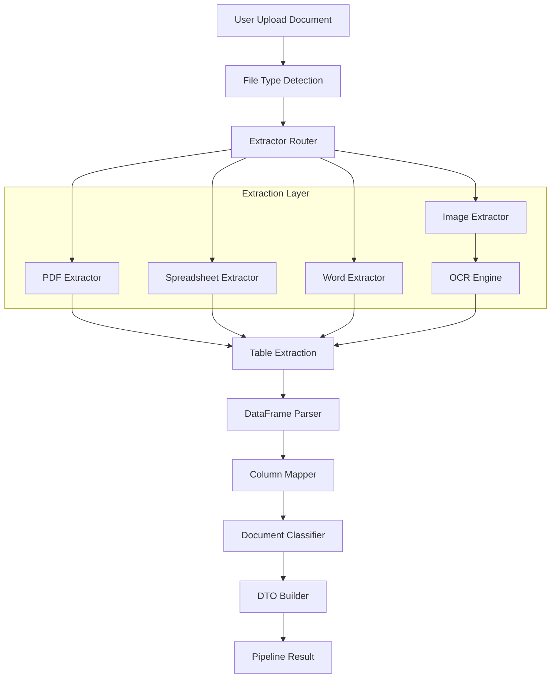
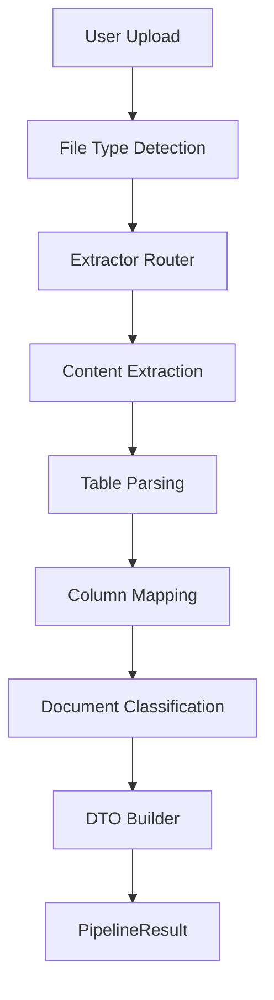

# Bullpholio Document Ingestion Pipeline

Bullpholio's Document Ingestion Pipeline extracts structured portfolio data from uploaded financial documents.

The system converts multiple document formats (PDF, Excel, Word, CSV, Images) into machine-readable structured data such as holdings and transaction records.

The pipeline intentionally avoids LLM dependency and instead uses deterministic rule-based parsing combined with OCR fallback to ensure reliability and speed.

---

# Features

Supported document types

| File Type | Extraction Method |
|---|---|
| CSV | pandas parsing |
| Excel (.xlsx) | pandas + openpyxl |
| Word (.docx) | python-docx |
| PDF (text-based) | pdfplumber |
| PDF (scanned) | OCR |
| Images (.png / .jpg / .jpeg) | OCR |

Output structure

```
PipelineResult
 ├── status
 ├── input_type
 ├── record_count
 └── tables
```

---

# System Requirements

Recommended Python version

```
Python >= 3.10
Python <= 3.12
```

Python 3.13 may cause compatibility issues with some OCR and OpenCV-related libraries.

Supported operating systems

- Windows 10+
- macOS
- Linux (Ubuntu 20+ recommended)

---

# Environment Setup

## 1. Install Python

Download Python from:

https://www.python.org/downloads/

Verify installation:

```
python --version
```

or

```
python3 --version
```

---

## 2. Create a Virtual Environment

Using a virtual environment is strongly recommended.

### Windows

```
python -m venv .venv
.venv\Scripts\activate
```

### macOS / Linux

```
python3 -m venv .venv
source .venv/bin/activate
```

After activation, you should see:

```
(.venv)
```

---

## 3. Upgrade pip

```
python -m pip install --upgrade pip
```

---

## 4. Install Python Dependencies

Install the required packages:

```
pip install pymupdf pdfplumber pandas openpyxl python-docx pillow easyocr opencv-python-headless numpy python-dotenv pydantic
```

Optional OCR / visualization improvements:

```
pip install scikit-image matplotlib
```

---

# System Dependencies

## Windows

Normally no additional installation is required.

Recommended:

- Microsoft Visual C++ Redistributable  
  https://learn.microsoft.com/en-us/cpp/windows/latest-supported-vc-redist

If EasyOCR / OpenCV installation fails, make sure:

- Python version is 3.10–3.12
- pip is upgraded
- virtual environment is activated

---

## Linux (Ubuntu)

Install required system libraries:

```
sudo apt update
sudo apt install -y tesseract-ocr libgl1
```

If you encounter image-processing or OpenCV issues, you may also need:

```
sudo apt install -y libglib2.0-0
```

---

## macOS

Using Homebrew:

```
brew install tesseract
```

If Homebrew is not installed:

https://brew.sh/

---

# Quick Start

Run the pipeline on a supported file:

```python
from bullpholio.pipeline import run_pipeline

result = run_pipeline("sample_statement.pdf")
print(result)
```

Example output:

```
PipelineResult(
 status="success",
 input_type="holding",
 record_count=4
)
```

---

# Project Structure

```
bullpholio
│
├── config
│   └── file_types.py
│
├── constants
│   └── column_aliases.py
│
├── core
│   ├── classifier.py
│   ├── column_mapper.py
│   ├── df_parser.py
│   ├── type_detector.py
│   └── errors.py
│
├── extractors
│   ├── router.py
│   ├── pdf_extractor.py
│   ├── spreadsheet_extractor.py
│   ├── word_extractor.py
│   ├── image_extractor.py
│   └── ocr_extractor.py
│
├── models
│   ├── dtos.py
│   └── results.py
│
└── pipeline.py
```
## Pipeline Stages

The document ingestion pipeline consists of four stages:

1. Ingestion  
2. Extraction  
3. Normalization  
4. Structured Output
# Pipeline Architecture



# Mermaid Architecture Diagram



---

# OCR Workflow

For scanned PDFs and images, the pipeline automatically falls back to OCR processing.

```
image preprocessing
        ↓
OCR recognition
        ↓
text normalization
        ↓
table reconstruction
```

Libraries used for OCR:

- EasyOCR
- OpenCV
- Pillow

---

# Performance

Typical processing time

| File Type | Latency |
|---|---|
| CSV | ~30 ms |
| Excel | ~40 ms |
| PDF (text) | ~100 ms |
| OCR image | ~500 ms |

---

# Design Philosophy

### Deterministic parsing

The pipeline avoids LLM usage to ensure predictable and auditable results.

### Strong typing

DTO models enforce consistent structured data.

### Fail-fast validation

Unsupported formats are rejected early.

### Modular architecture

Each stage of the pipeline can be replaced independently.

---

# Future Improvements

Planned improvements

- ML-based table detection
- broker-specific parsing templates
- multilingual OCR
- improved error reporting
- streaming ingestion support

---

# License

Internal Bullpholio Project

# Environment options

pip users:
   - pip install -r requirements.txt

conda users:
   - conda env create -f environment.linux.yml
   - conda env create -f environment.windows.yml